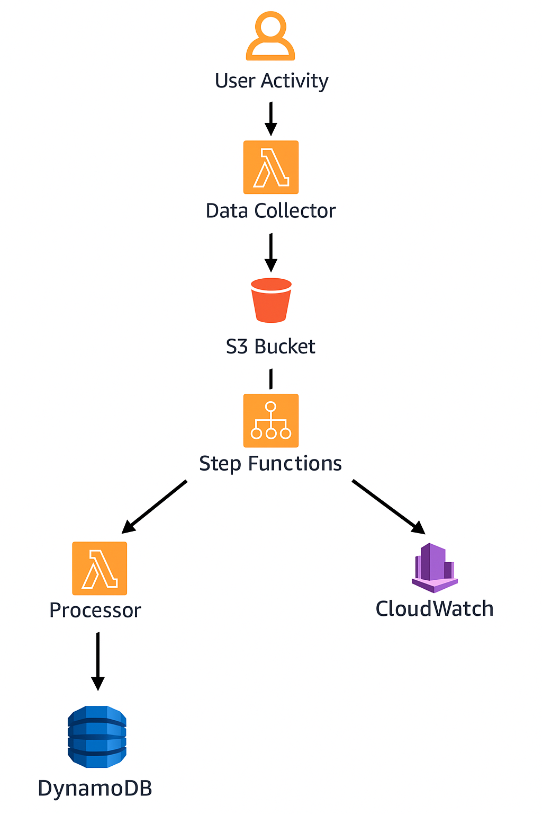

**Event-Driven Data Pipeline**

[]()
[]()
[]()
[]()
[]()


## Table of Contents

1. [Overview](#1-overview)
2. [Architecture](#2-architecture)
3. [Services Used](#3-services-used)
4. [Project Folder Structure](#4-project-folder-structure)
5. [Setup Instructions](#5-setup-instructions)
6. [Execution Flow](#6-execution-flow)
7. [Monitoring & Alerts](#7-monitoring--alerts)
8. [Data Quality Checks](#8-data-quality-checks)
9. [Unit Testing](#9-unit-testing)
10. [Future Improvements](#10-future-improvements)
11. [Resources & References](#11-resources--references)


## 1) Overview

This project is an event-driven data pipeline built with AWS. It automatically collects, processes, and stores user activity data using S3, Lambda, Step Functions, and DynamoDB. The pipeline is serverless, scalable, and monitored with CloudWatch—making it easy to handle data in real time with minimal manual effort.


## 2) Architecture




## 3) Services Used

- **S3:** Stores raw user activity events.
- **Lambda:** Serverless compute for collection & processing.
- **Step Functions:** Orchestrates workflow with error handling.
- **DynamoDB:** Stores processed user activity records.
- **CloudWatch:** Monitors logs, metrics, and alerts.
- **IAM:** Secure access control for all services.
- **Terraform:** Infrastructure as Code for full automation.
- **Python:** Transaction generator & Lambda logic.


## 4) Project Folder Structure

```
event-driven-pipeline/
│── lambdas/
│   ├── data_processor.py    
│   └── orchestrator.py         
│
│── terraform/
│   ├── main.tf                
│   ├── lambda.tf               
│   ├── s3.tf                  
│   ├── dynamodb.tf           
│   ├── cloudwatch.tf                 
│   ├── iam.tf                
│   ├── ssm.tf               
│   ├── variables.tf                 
│   ├── sfn.tf                 
│   └── outputs.tf              
│
│── sdk-scripts/
│   ├── upload_test_file.py 
│   └── upload_bulk_data.py     
│
└── README.md                    
```


## 5) Setup Instructions

### Prerequisites

- AWS account with permissions for S3, Lambda, Step Functions, DynamoDB, IAM, and CloudWatch.
- Terraform installed.
- Python 3.9+ installed (for simulator)

### Steps

#### (i) Clone the Repository

```bash
git clone <repo-url>
cd event-driven-pipeline
```

#### (ii) Configure AWS Credentials

```bash
aws configure
```

#### (iii) Deploy Infrastructure with Terraform

```bash
terraform init
terraform plan
terraform apply
```

#### (iv) Run the test_data_file

```bash
cd ./sdk-scripts/
REGION="us-east-2"
python upload_test_file.py
```

#### (v) Running the 5 GiB Load Test

```bash
export BUCKET="user-activity-bucket-demo-1234"
export S3_BUCKET=$(terraform output -raw s3_bucket_name)
export ROWS_PER_FILE="10000"
export TOTAL_FILES="20"
export WORKERS="8"

cd ./sdk-scripts/
python upload_bulk_data.py
```


## 6) Execution Flow

1. **Data Ingestion**
    - Applications export user-activity events as JSON/JSONL (optionally gzipped).
    - Files are uploaded to Amazon S3 under the `ingest/` prefix (e.g., `ingest/YYYY/MM/dd/file.jsonl[.gz]`).

2. **Orchestration**
    - An S3 ObjectCreated event triggers the Orchestrator Lambda.
    - Orchestrator reads the State Machine ARN from SSM Parameter Store and starts an AWS Step Functions execution with `{bucket, key}`.

3. **Processing**
    - Step Functions invokes the Processor Lambda with the S3 object details.
    - Processor Lambda downloads the file from S3, decompresses if `.gz`, and parses JSON Lines.
    - Validates required fields (e.g., `user_id`, `timestamp/id`), normalizes types (timestamps, decimals).
    - Writes valid records to Amazon DynamoDB using batch writes for throughput.

4. **Monitoring**
    - Amazon CloudWatch captures logs from both Lambdas and the Step Functions execution history.
    - CloudWatch Metrics & Alarms track Step Functions failures, Lambda errors/duration, and DynamoDB throttling—alerting the team when thresholds are exceeded.

5. **Error Handling**
    - Malformed rows are counted and logged; the run can still succeed if non-fatal (summary includes lines, written, errors).
    - Unhandled exceptions cause the state machine to transition to Fail, which is surfaced via CloudWatch alarms.


## 7) Monitoring & Alerts

Monitoring ensures the pipeline runs smoothly and alerts stakeholders if something goes wrong.

- **CloudWatch Logs**
    - Each Lambda function writes detailed logs (inputs, errors, processing statistics).
    - Step Functions logs execution history and state transitions.
- **CloudWatch Alarms**
    - Alerts are configured to notify developers if thresholds are crossed:
        - High Lambda error rates.
        - DynamoDB throttling or latency spikes.
        - Step Function executions ending in failure.


## 8) Data Quality Checks

Data Quality Checks (DQCs) are automated rules or validations you apply to data to make sure it’s clean, complete, and trustworthy before using or storing it.  
For example: It’s like checking groceries before putting them in the fridge.  

You want to: 
- Remove spoiled items 
- Make sure you didn’t miss anything important 
- Ensure everything is labeled and stored correctly


## 9) Unit Testing

Unit testing means checking that small pieces of our code (called “units”) work as expected—in isolation, without depending on the whole system.  
Think of unit testing like checking each Lambda function or helper separately: for example, you test the S3 ingestion logic, the data processor, and the orchestrator independently before running the full pipeline. In this project, a "unit" is typically a function in your Lambda code or a utility in `lambdas/data_quality.py`.

**How to Run Unit Tests & Data Quality Checks:**
```powershell
# Run all unit tests in the tests directory
python -m unittest discover tests/

# Run data quality tests specifically (if using pytest)
pytest tests/test_data_quality.py
```
Before running tests, install dependencies:
```powershell
pip install -r requirements.txt
```

**Examples of Unit Tests in This Project:**
- `validate_item()` – Checks that a data record from S3 contains all required fields and correct types (see `lambdas/data_quality.py`).
- `validate_json_line()` – Ensures each line in a gzipped JSONL file is valid and meets schema requirements.
- `lambda_handler()` in `data_processor.py` – Can be tested with mock S3 events to verify correct DynamoDB writes and error handling.

These tests help ensure your pipeline only processes valid, well-formed data and that each Lambda function works as expected in isolation.


## 10) Future Improvements

While the pipeline works as designed, future enhancements can improve scalability, functionality, and usability.

- **Real-Time Processing**
    - Replace file-based ingestion with Kinesis Data Streams for true real-time analytics.
- **Data Lake Integration**
    - Store all events in S3 Data Lake with partitioning for analytics using Athena or Glue.
- **Error Management**
    - Implement a dedicated DLQ (Dead-Letter Queue) to reprocess failed events automatically.
- **Security Enhancements**
    - Encrypt data at rest in S3 and DynamoDB with KMS.
    - Enforce fine-grained IAM roles for least privilege access.
- **Visualization**
    - Build a dashboard (QuickSight or custom web app) to visualize user activity trends in near real-time.
- **CI/CD Integration**
    - Automate deployment of Lambda functions and Terraform changes using AWS CodePipeline or GitHub Actions.


## 11) Resources & References


- [AWS Lambda Documentation](https://docs.aws.amazon.com/lambda/latest/dg/welcome.html)
- [AWS S3 Documentation](https://docs.aws.amazon.com/s3/index.html)
- [AWS Step Functions Documentation](https://docs.aws.amazon.com/step-functions/index.html)
- [AWS DynamoDB Documentation](https://docs.aws.amazon.com/dynamodb/index.html)
- [AWS CloudWatch Documentation](https://docs.aws.amazon.com/cloudwatch/index.html)
- [Terraform AWS Provider](https://registry.terraform.io/providers/hashicorp/aws/latest/docs)
- [Python Official Documentation](https://docs.python.org/3/)
- [Boto3 AWS SDK for Python](https://boto3.amazonaws.com/v1/documentation/api/latest/index.html)
- [Data Engineering on AWS](https://aws.amazon.com/big-data/datalakes-and-analytics/)
- [Serverless Architectures](https://martinfowler.com/articles/serverless.html)
